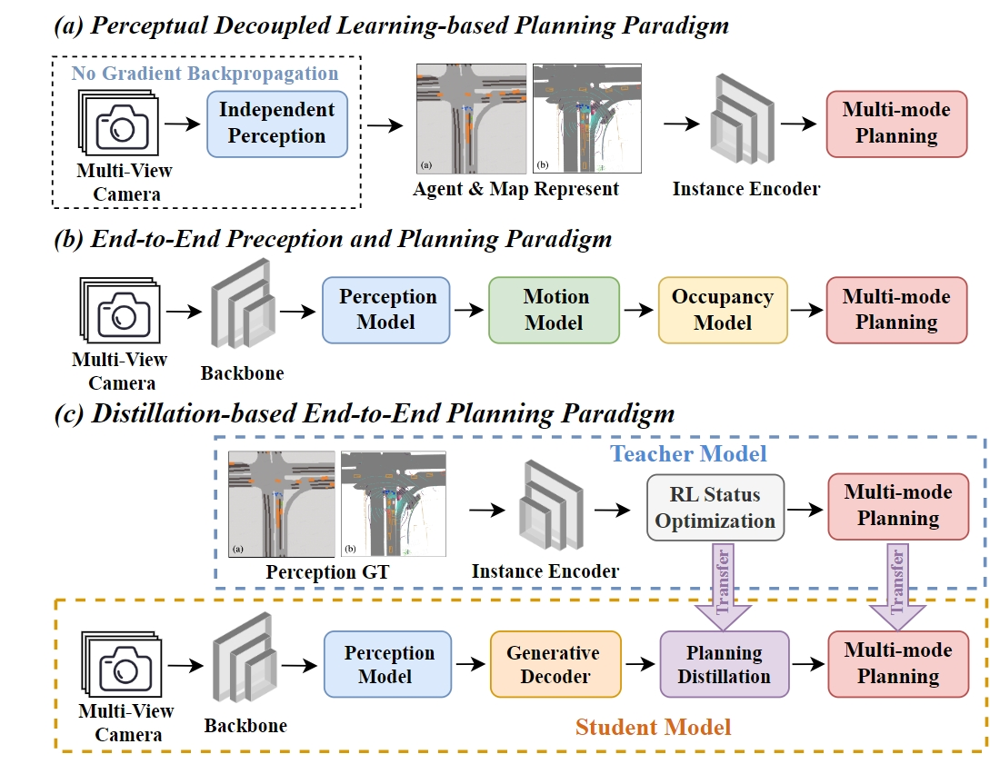
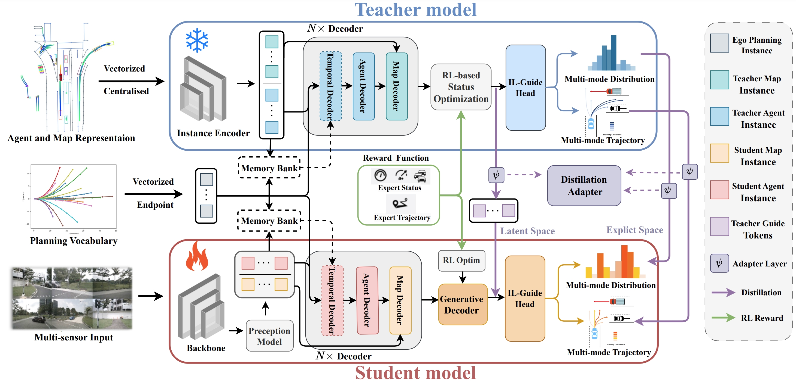

<h1>DistillDrive</h1>
<h3>End-to-End Multi-Mode Autonomous Driving Distillation by Isomorphic Hetero-Source Planning Model</h3>
<strong>Accepted to ICCV 2025</strong>

[Rui Yu](https://github.com/YuruiAI)1, Xianghang Zhang2, [Runkai Zhao](https://scholar.google.com/citations?user=JvoODTgAAAAJ&hl=zh-CN)3, [Huaicheng Yan](https://scholar.google.com/citations?user=FDNcY_MAAAAJ&hl=zh-CN)1, [Meng Wang](https://scholar.google.com/citations?user=_abJw5cAAAAJ&hl=zh-CN)1, 

1 East China University of Science and Technology， 2 SenseAuto Research, 3 The University of Sydney

&nbsp;
&nbsp;

## News
<!-- * **`24 , 2025`:** We reorganize code for better readability. Code & Models are released. -->
* **` Sep. 7th, 2025`:** We reorganize code for better readability. Code & Models are released.
* **`Aug. 08, 2025`:** We release the SparseDrive paper on [arXiv](https://arxiv.org/abs/2508.05402). 
* **`Jun. 26, 2025`:** DistillDrive is accepted to ICCV 2025!

## Introduction
> We introduce DistillDrive, an end-to-end knowledge distillation-based autonomous driving model that leverages diversified instance imitation to enhance multi-mode motion feature learning
- We propose a distillation architecture for multi-mode instance supervision in end-to-end planning, tackling single-target imitation learning limitations.
- We introduce reinforcement learning-based state optimization to enhance state-to-decision space understanding and mitigate ego motion state leakage.
- To address missing motion-guided attributes, we use a generative model for distribution-wise interaction between expert trajectories and instance features.
- We conduct open- and closed-loop planning experiments on the nuScenes and NAVSIM datasets, achieving a 50% reduction in collision rate and a 3-point increase in both EP and PDMS over the baseline.

## Overview
The Overview of our proposed DistillDrive. Initially, we train a teacher model with scene-structured annotation data, integrating reinforcement and imitation learning to enhance multi-mode planning. Subsequently, we constructed an end-to-end student model and used a generative model to implement motion-oriented distribution interactions in latent space. Ultimately, multi-stage knowledge distillation and multi-mode supervision synergistically enhance the planning diversity and safety margins of autonomous driving models.

- Open-loop planning results on [nuScenes](https://github.com/nutonomy/nuscenes-devkit).

| Model                     | Input      | 1s    | 2s    | 3s    | Avg. | 1s    | 2s    | 3s    | Avg. | FPS ↑ |
|----------------------------|-----------|-------|-------|-------|------|-------|-------|-------|------|-------|
|                            |           | **L2 (m) ↓** |       |       |      | **Collision (%) ↓** |       |       |      |       |
| FF                  | LiDAR     | 0.55  | 1.20  | 2.54  | 1.43 | 0.06  | 0.17  | 1.07  | 0.43 | -     |
| EO                 | LiDAR     | 0.67  | 1.36  | 2.78  | 1.60 | 0.04  | 0.09  | 0.88  | 0.33 | -     |
| ST-P3            | Camera    | 1.33  | 2.11  | 2.90  | 2.11 | 0.23  | 0.63  | 1.27  | 0.71 | 1.6   |
| UniAD           | Camera    | 0.45  | 0.70  | 1.04  | 0.73 | 0.62  | 0.58  | 0.63  | 0.61 | 1.8   |
| VAD               | Camera    | 0.41  | 0.70  | 1.05  | 0.72 | 0.03  | 0.19  | 0.43  | 0.21 | 4.5   |
| SparseDrive| Camera    | 0.31  | 0.60  | 1.00  | 0.63 | 0.01  | 0.08  | 0.30  | 0.13 | 6.5   |
| DistillDrive (Teacher)     | Annotation| 0.27  | 0.51  | 0.82  | 0.53 | 0.01  | 0.04  | 0.10  | 0.05 | 31.6  |
| DistillDrive (Student)     | Camera    | **0.28** | **0.54** | **0.83** | **0.57** | **0.00** | **0.03** | **0.17** | **0.06** | 6.0   |

- Close-loop planning results on [NAVSIM](https://github.com/autonomousvision/navsim).

| Model                 | Input  | Backbone   | NC ↑  | DAC ↑ | TTC  | Comf. ↑ | EP ↑ | PDMS ↑ |
|------------------------|--------|------------|-------|-------|------|----------|------|--------|
| Const Velocity         | -      | -          | 69.0  | 57.8  | 58.0 | **100**  | 19.4 | 20.6   |
| Ego Status MLP         | -      | -          | 93.0  | 77.3  | 83.6 | **100**  | 62.8 | 65.6   |
| UniAD        | C      | ResNet-34  | 97.8  | 91.9  | 92.2 | **100**  | 78.8 | 83.4   |
| VADV2        | C      | ResNet-34  | 92.2  | 89.1  | 91.6 | **100**  | 76.0 | 80.9   |
| Transfuser | C & L  | ResNet-34  | 97.8  | 92.3  | 92.9 | **100**  | 78.6 | 83.5   |
| Hydra-MDP   | C & L  | ResNet-34  | 97.9  | 91.7  | 92.9 | **100**  | 77.6 | 83.0   |
| DistillDrive (Teacher) | GT     | -          | 97.5  | 96.0  | 92.8 | **100**  | 81.0 | 86.5   |
| DistillDrive (Student) | C & L  | ResNet-34  | **98.1** | **94.6** | **93.6** | **100** | **81.0** | **86.2** |

| Modle Name                            | Stage   | Weight Download |
|-------------------------------------|--------|------|
| distilldrive_stage0_distribution.pth | stage0 | [huggingface](https://huggingface.co/RuiYuStudying/DistillDrive/blob/main/distilldrive_stage0_distribution.pth) |
| distilldrive_stage0_label.pth        | stage0 | [huggingface](https://huggingface.co/RuiYuStudying/DistillDrive/blob/main/distilldrive_stage0_label.pth) |
| distilldrive_stage1_adamax.pth       | stage1 | [huggingface](https://huggingface.co/RuiYuStudying/DistillDrive/blob/main/distilldrive_stage1_adamax.pth) |
| distilldrive_stage1_soap.pth         | stage1 | [huggingface](https://huggingface.co/RuiYuStudying/DistillDrive/blob/main/distilldrive_stage1_soap.pth) |
| distilldrive_stage2_distribution.pth | stage2 | [huggingface](https://huggingface.co/RuiYuStudying/DistillDrive/blob/main/distilldrive_stage2_distribution.pth) |
| distilldrive_stage2_label.pth        | stage2 | [huggingface](https://huggingface.co/RuiYuStudying/DistillDrive/blob/main/distilldrive_stage2_label.pth) |

## Getting Started
- [Preparation of DistillDrive environment](docs/install.md)
- [Getting started from nuScenes environment preparation](docs/preparedata.md)
- [Training and Evaluation](docs/train.md)

## Video Demo on Real-world Application
https://huggingface.co/RuiYuStudying/DistillDrive/blob/main/demo.mp4

## Acknowledgement
- [SparseDrive](​https://github.com/swc-17/SparseDrive)
- [Sparse4D](​https://github.com/HorizonRobotics/Sparse4D)
- [UniAD](​https://github.com/OpenDriveLab/UniAD) 
- [VAD](​https://github.com/hustvl/VAD)
- [StreamPETR](​https://github.com/exiawsh/StreamPETR)
- [StreamMapNet](​https://github.com/yuantianyuan01/StreamMapNet)
- [mmdet3d](​https://github.com/open-mmlab/mmdetection3d)

